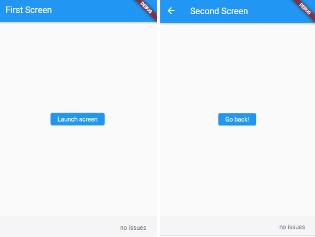
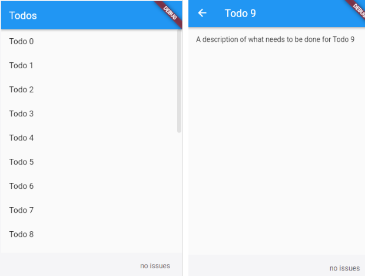

#  Navigator 화면 전환과 Named routes 설정

아래와 같이 두 화면(FirstScreen, SecondScreen)이 존재할때
Navigator를 이용해 화면 전환을 할 수 있다.

```
class FirstScreen extends StatelessWidget {
  @override
  Widget build(BuildContext context) {
    return Scaffold(
      appBar: AppBar(
        title: Text('First Screen'),
      ),
      body: Center(
        child: RaisedButton(
          child: Text('Launch screen'),
          onPressed: () {
            // 클릭하면 두 번째 화면으로 전환합니다!
          },
        ),
      ),
    );
  }
}

class SecondScreen extends StatelessWidget {
  @override
  Widget build(BuildContext context) {
    return Scaffold(
      appBar: AppBar(
        title: Text("Second Screen"),
      ),
      body: Center(
        child: RaisedButton(
          onPressed: () {
            // 클릭하면 첫 번째 화면으로 돌아갑니다!
          },
          child: Text('Go back!'),
        ),
      ),
    );
  }
}
```

### 1. 화면 전환
Navigator  스택에 push와 pop을 이용해 화면을 전환합니다.

인자로는 context 와 MaterialPageRoute가 들어가며

아래와 같이 코드를 작성하면 됩니다.

```
// Within the `FirstRoute` widget
onPressed: () {
  Navigator.push(
    context,
    MaterialPageRoute(builder: (context) => const SecondScreen()),
  );
}
```


### 2. named routes 을 이용한 화면 전환

MaterialPageRoute에 조금 복잡해보이는 코드를 작성하기 싫을때,

최상단의 MaterialApp 부분에서 routes를 이용해 PageRoute 를 명명해둘 수 있습니다.
```
MaterialApp(
  title: 'Named Routes Demo',
  // Start the app with the "/" named route. In this case, the app starts
  // on the FirstScreen widget.
  initialRoute: '/',
  routes: {
    // When navigating to the "/" route, build the FirstScreen widget.
    '/': (context) => const FirstScreen(),
    // When navigating to the "/second" route, build the SecondScreen widget.
    '/second': (context) => const SecondScreen(),
  },
)

```
주석에도 잘 적혀있듯이 routes는 "/" 를 포함해서 시작해야하며,

"/" 만 존재하는 Pageroutes는 initialRoute를 명시하지않아도 초기화면이 됩니다.


pushNamed(context, routes명) 으로 사용하면 됩니다..
```
// Within the `FirstScreen` widget
onPressed: () {
  // Navigate to the second screen using a named route.
  Navigator.pushNamed(context, '/second');
}

```


### 3. 파라미터 전달

화면을 전환할 때, 해당화면에 데이터를 넘겨주고 싶을때가 있다.

위와같이 ListView에서 특정 List에 Detail화면에 들어갈때 데이터를 전달해주기 위해서

해당 클래스에 파라미터를 전달한다.

```
class DetailScreen extends StatelessWidget {
  // 생성자 부분 require a Todo.
  const DetailScreen({super.key, required this.todo});

  // Declare Todo 필드
  final Todo todo;

  @override
  Widget build(BuildContext context) {
    // 받아온 Todo 필드를 UI에 사용
    return Scaffold(
      appBar: AppBar(
        title: Text(todo.title),
      ),
      body: Padding(
        padding: const EdgeInsets.all(16.0),
        child: Text(todo.description),
      ),
    );
  }
}
```


전체 코드
```
import 'package:flutter/material.dart';

class Todo {
  final String title;
  final String description;

  const Todo(this.title, this.description);
}

void main() {
  runApp(
    MaterialApp(
      title: 'Passing Data',
      home: TodosScreen(
        todos: List.generate(
          20,
          (i) => Todo(
            'Todo $i',
            'A description of what needs to be done for Todo $i',
          ),
        ),
      ),
    ),
  );
}

class TodosScreen extends StatelessWidget {
  const TodosScreen({super.key, required this.todos});

  final List<Todo> todos;

  @override
  Widget build(BuildContext context) {
    return Scaffold(
      appBar: AppBar(
        title: const Text('Todos'),
      ),
      body: ListView.builder(
        itemCount: todos.length,
        itemBuilder: (context, index) {
          return ListTile(
            title: Text(todos[index].title),
            // When a user taps the ListTile, navigate to the DetailScreen.
            // Notice that you're not only creating a DetailScreen, you're
            // also passing the current todo through to it.
            onTap: () {
              Navigator.push(
                context,
                MaterialPageRoute(
                  builder: (context) => DetailScreen(todo: todos[index]),
                ),
              );
            },
          );
        },
      ),
    );
  }
}

class DetailScreen extends StatelessWidget {
  // In the constructor, require a Todo.
  const DetailScreen({super.key, required this.todo});

  // Declare a field that holds the Todo.
  final Todo todo;

  @override
  Widget build(BuildContext context) {
    // Use the Todo to create the UI.
    return Scaffold(
      appBar: AppBar(
        title: Text(todo.title),
      ),
      body: Padding(
        padding: const EdgeInsets.all(16.0),
        child: Text(todo.description),
      ),
    );
  }
}
```